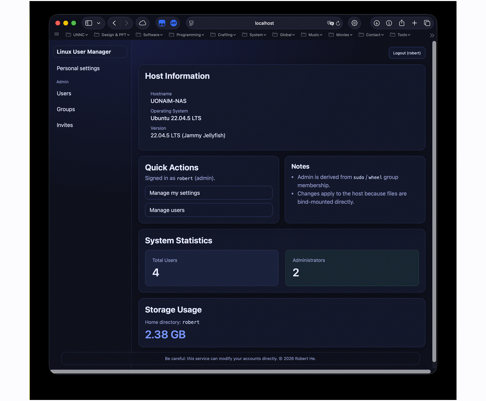

# `lumgr` - Linux User Manager

A modern, containerized web-based user management interface for Linux systems. Manage users, groups, permissions, and SSH keys through an intuitive dashboard accessible on port `14392`.


## Demo



## Features

### User Management

- **Create & Delete Users** - Full user lifecycle management with automatic home directory creation
- **Password Management** - Secure password changes with shadow file integration
- **Group Assignment** - Add/remove users from groups including sudo/wheel for admin privileges
- **Shell Configuration** - Select from available shells detected from `/etc/shells`
- **SSH Key Management** - Generate SSH key pairs, change key passphrases, export public keys, and manage `~/.ssh/authorized_keys` directly from the web UI
- **Git Configuration** - Set user.name, user.email, and signing key in `~/.gitconfig`
- **Ubuntu Desktop Support** - Automatically adds necessary groups for desktop login on Ubuntu systems

### Advanced Features

- **Recursive Permission Management** - Apply chmod recursively to home directories with granular control
- **Special Permission Bits** - Configure SetUID (4000), SetGID (2000), and Sticky bit (1000)
- **File Permission Display** - Real-time octal notation display (e.g., 2770, 0755)
- **Registration System** - Invite-based or open registration with default group assignment
- **Smart Defaults** - Auto-copy `.bashrc` templates (Ubuntu-specific when detected)
- **User Settings Portal** - Non-admin users can manage their own settings

### System Information

- **Dashboard Stats** - Storage usage, user counts, system information
- **OS Detection** - Display hostname, OS name, and version from `/etc/os-release`

### System Resource Monitor (resmon)

`resmon` is an optional subsystem that samples host resource usage (CPU, memory, disk I/O, filesystems, network and per-user aggregates) and persists rolling history in `lumgr_data/resmon_history/` as daily files (for example `2026-02-16.json`). To enable full host-level monitoring when running in a container, bind-mount the host `/proc` into `/host/proc` (read‑only). The service automatically prefers `/host/proc` and falls back to `/proc` when `/host/proc` is not present.

- Configure sampling interval, retention days, and which metrics to collect from the Admin → Resources page.
- Current metrics are shown on the Dashboard and historical charts are available to administrators under Admin → Resources.
- Historical data path: `lumgr_data/resmon_history/` (date-partitioned files, only present when resmon is enabled).

- **Admin/Regular User Views** - Contextual interfaces based on privilege level

### Technical Features

- **`.lumgrc` Architecture** - Separate lumgr config from user shell configs
- **Automatic Shell Integration** - Sources `.lumgrc` in `.bashrc`/`.zshrc` for TERM and redirect settings
- **System Group Filtering** - Collapse system users (UID < 1000) and groups for cleaner views
- **Comprehensive Logging** - Track all user operations and administrative actions
- **JWT Authentication** - Secure session management with configurable secrets

## Quick Start

### Using Docker Compose (Recommended)

1. **Create `docker-compose.yml`:**

```yaml
services:
  lumgr:
    # build: .
    image: ghcr.io/hnrobert/lumgr:latest
    container_name: lumgr
    ports:
      - "14392:14392"
    environment:
      - LUMGR_LISTEN=:14392
      - LUMGR_JWT_SECRET=your-secret-key-here # Optional: Set custom JWT secret
    volumes:
      - ./lumgr_data:/lumgr_data # Config & invite storage
      - /home:/home # User home directories
      - /etc/passwd:/etc/passwd # User database
      - /etc/shadow:/etc/shadow # Password hashes
      - /etc/group:/etc/group # Group database
      - /etc/localtime:/etc/localtime:ro # Timezone info
      - /etc/shells:/etc/shells:ro # Available shells
      - /etc/os-release:/etc/os-release:ro # OS info
      - /etc/hostname:/etc/hostname:ro # Hostname
      - /proc:/host/proc:ro # Required for resmon (system resource monitor) - read-only host /proc
    restart: always
```

1. **Start the service:**

```bash
docker compose up -d
```

1. **Access the web UI:**

Open `http://your-server:14392` in your browser and log in with an existing Linux user account that has sudo privileges.

### Manual Build

```bash
# Clone the repository
git clone https://github.com/hnrobert/lumgr.git
cd lumgr

# Build with Go
make build

# Run the binary
./bin/lumgrd
```

## Configuration

### Environment Variables

| Variable | Default | Description |
|----------|---------|-------------|
| `LUMGR_LISTEN` | `:14392` | HTTP listen address |
| `LUMGR_JWT_SECRET` | (ephemeral) | JWT signing secret (randomly generated if not set) |

### Data Directory

The `lumgr_data` directory contains:

- `config.json` - Registration mode and default groups
- `invites.json` - Invitation codes and usage tracking
- `resmon_history/` - Persisted system resource history directory with daily files (`YYYY-MM-DD.json`, created when resmon is enabled)

### Registration Modes

Configure in the web UI under Admin settings:

- **Admin Only** - Only administrators can create users
- **Open** - Anyone can register (with optional default group assignment)
- **Invite** - Registration requires a valid invite code with group presets

## Security Considerations

1. **Host Filesystem Access** - lumgr has direct access to `/etc/passwd`, `/etc/shadow`, `/etc/group`, and `/home`
2. **Run with Caution** - Only deploy in trusted environments
3. **HTTPS Recommended** - Use a reverse proxy (nginx, Caddy) with HTTPS in production
4. **Admin Privileges** - Admin access is determined by `sudo` or `wheel` group membership
5. **JWT Secrets** - Set `LUMGR_JWT_SECRET` to a strong random value for persistent sessions

## User Interface

### Dashboard

- Storage usage for current user's home directory
- System statistics (total users, admin count) for administrators
- Host information (hostname, OS, version)
- Quick actions for settings and user management

### User Management (Admin)

- List all users with collapsible system users (UID < 1000)
- Create new users with custom UID, home directory, shell, and groups
- Edit existing users: password, groups, shell selection
- Recursive permission management with octal notation
- Delete users with optional home directory removal

### Group Management (Admin)

- View all groups with collapsible system groups (GID < 1000)
- Add/remove users from groups
- Support for privileged groups (sudo, docker, wheel)

### Registration Portal (Admin)

- Generate invite codes with expiration, usage limits, and group assignments
- Toggle between invite-based and open registration
- Configure default groups for open registration

### Settings (All Users)

- Change default shell from available options
- Configure TERM environment variable
- Set login redirect directory
- Manage Git user.name, user.email, and signing key
- Configure SSH authorized_keys and manage SSH key pairs
- Set umask for new files
- Change account password

## Technical Architecture

### Backend

- **Language:** Go 1.22+
- **Framework:** Standard library `net/http`
- **Authentication:** JWT tokens with HTTP-only cookies
- **User Management:** Direct parsing and writing of `/etc/passwd`, `/etc/shadow`, `/etc/group` files

### Frontend

- **Templates:** Go HTML templates with embedded CSS
- **Styling:** Custom CSS with dark theme
- **Responsive:** Mobile-friendly with adaptive layouts

### Key Components

```bash
cmd/lumgrd/main.go          # Entry point, sets lumgr_data permissions
internal/
  ├── auth/                 # JWT & password verification
  ├── config/               # Configuration storage
  ├── hostfs/               # Host filesystem access abstraction
  ├── invite/               # Invitation system
  ├── logger/               # Logging utilities
  ├── server/               # HTTP handlers & routing
  │   ├── handlers.go       # Main request handlers
  │   ├── settings_store.go # User settings management
  │   └── templates/        # HTML templates
  ├── usercmd/              # User/group operations wrapper
  └── usermgr/              # Passwd/shadow/group parsers
```

## File Management

### User Home Directory Files

lumgr manages these files automatically:

- `~/.ssh/authorized_keys` - SSH public keys
- `~/.gitconfig` - Git user configuration
- `~/.lumgrc` - lumgr-specific settings (TERM, redirect)
- `~/.bashrc` / `~/.zshrc` - Auto-sources `~/.lumgrc`
- `.bashrc` template - Copied on user creation (Ubuntu-specific if detected)

### Special Handling

- **`.ssh` Directory** - Excluded from recursive chmod operations
- **System Users** - Users with UID < 1000 are hidden by default
- **System Groups** - Groups with GID < 1000 are collapsed
- **Ubuntu Desktop Login** - Users created on Ubuntu systems are automatically added to necessary desktop groups (`video`, `audio`, `input`, `plugdev`, `cdrom`, `dialout`, `lpadmin`, `adm`, `netdev`) for proper desktop environment access

## Contributing

Contributions are welcome! Please feel free to submit issues and pull requests.

## License

This project is licensed under the `Apache 2.0 License` - see the [LICENSE](LICENSE) file for details.

## Disclaimer

lumgr directly modifies critical system files. Use at your own risk. Always maintain backups of `/etc/passwd`, `/etc/shadow`, and `/etc/group` before using this tool in production environments.

## Links

- **GitHub:** [https://github.com/hnrobert/lumgr](https://github.com/hnrobert/lumgr)
- **GHCR Image:** [ghcr.io/hnrobert/lumgr](https://ghcr.io/hnrobert/lumgr)
- **Issues:** [https://github.com/hnrobert/lumgr/issues](https://github.com/hnrobert/lumgr/issues)
